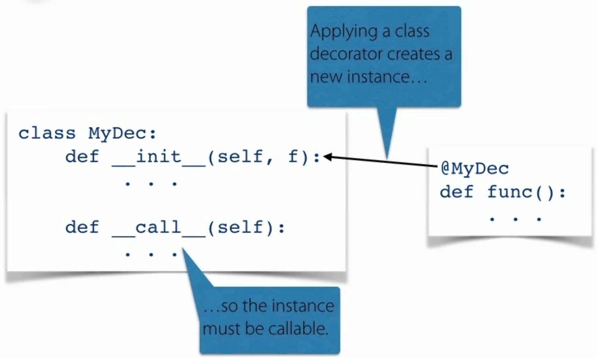

# Closures and Decorators

## Local Function

### 00 Local Function
  - New local function is created each time it's parent function is called
  ```python
  def sort_by_last_letter(strings):
    def last_letter(s):
        return s[-1]
    return sorted(strings, key=last_letter)
  ```
  
  - LEGB Rule
    - local, enclosing, global, built-in
  ```python
  g = 'global'
  def outer(p='param'):
      l = 'local'
      def inner():
          print(g, p, l)
      inner()
  ```
  
  - Local functions are useful for
    - more readable and general than lambda

  ### 01 Returning functions from functions (First class functions)
```python
def enclosing():
  def local_func():
    print('local func')
  return local_func

lf = enclosing()
# invoke the function
lf()
```

### 02 Closures

Maintains reference to objects from earlier scope

__closure__

```python
def enclosing():
  x = 'closed over'
  def local_func():
    print(x)
  return local_func

lf = enclosing()
lf()
print(lf.__closure__) # references x
```

### 03 Function Factories

- Function Factories: functions that return new, specialized functions

```python
def raise_to(exp):
  def raise_to_exp(x):
    return pow(x, exp)
  return raise_to_exp

square = raise_to(2)
print(square.__closure__) # refers to 2

print(square(2))
print(square(4))

cube = raise_to(3)
print(cube(3))
```


## Global and Local Variables

  - `global` to redefine global variables
  - `nonlocal` to redefine variables in the enclosing scope (will raise
    `SyntaxError` if there is not such variable in the enclosing scope)

## Decorators

- modify and enhance functions without changing their definitions
- Implemented as callables that take and return other callables
- Take a function and return a new function

```python
def escape_unicode(f):
  def wrap(*args, **kwargs):
    x = f(*args, **kwargs)
    return ascii(x)
  
  return wrap

def chinese():
  return "中"

@escape_unicode
def ascii_chinese():
  return "中"

print(chinese())
print(ascii_chinese())
```

### Classes as Decorators

- Applying a class decorator creates a new instance

Classes must implement the __call__ method




```python
class CallCount:
  def __init__(self, f):
    self.f = f
    self.count = 0
  
  def __call__(self, *args, **kwargs):
    self.count += 1
    return self.f(*args, **kwargs)

@CallCount
def hello(name):
  print('Hello {}'.format(name))

hello("Jerry")
hello("Leo")
hello("Amy")
print(hello.count)
```

### 08 Instances as Decorators


### 09. Multiple Decorators

### 10. Decorating Methods

### 11. functools.wraps()

### 12.Duck Tails Validating Arguments


When there are multiple decorators, the last one will evalute first


## `functools.wraps()`

Updates wrapped functions metadata

```python
def hello():
    print('Hello world!')

print(hello.__name__)
# hello

def noop(func):
    def noop_wrapper():
        return func()
    return noop_wrapper

@noop
def hello2():
    print('Hello world!')

print(hello2.__name__)
# noop_wrapper

import functools

def noop(func):
    @functools.wraps(func)
    def noop_wrapper():
        return func()
    return noop_wrapper

@noop
def hello3():
    print('Hello world!')

print(hello3.__name__)
# hello3
```

